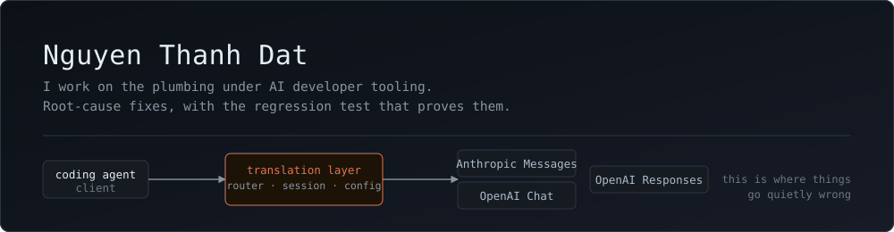

I work on the plumbing under AI developer tooling — the API routers, session
stores, and configuration managers that sit between a coding agent and the
models it talks to. Almost all of it is root-cause work in codebases I did not
write.

Where the project has a test suite, every patch below ships with a regression
test that I verify fails on `main` before I open the pull request. The two drawdb
pull requests do not, because that repository has no test runner at all; those
carry a written reproduction instead.

### Contribution record

Public data for [`ntdatt812`](https://github.com/ntdatt812), counted **2026-08-26**,
covering the preceding 12 months. "Landed" means the change is in the upstream
default branch of a repository I do not own — as a merged pull request, or as a
commit the maintainer cherry-picked from one. Pull requests in my own repositories are
not counted — the figures are what `gh search prs --author ntdatt812` returns once
`ntdatt812/*` is excluded.

| | Count | What it counts |
| --- | ---: | --- |
| Pull requests merged | **28** | Merged by maintainers of repos I don't own |
| Additional commits landed | **6** | In `decolua/9router` `master`; the PRs were closed and the work cherry-picked |
| Security advisories | **1** | Published, credited as reporter |
| Pull requests open | **71** | Awaiting maintainer review |
| Repositories | **15** | Third-party repos I've contributed to |

I am not a maintainer of any of these projects, and I don't claim to be.

### Security

**[GHSA-w8pw-h853-frw2](https://github.com/jdx/mise/security/advisories/GHSA-w8pw-h853-frw2)**
— [jdx/mise](https://github.com/jdx/mise), 33.0k★. Moderate, CVSS 4.0 **5.9**.
Affects `<= 2026.8.7`, patched in **2026.8.9**. Reported privately, published by the
maintainer, credited as reporter.

`gitlab::get_headers` and `forgejo::get_headers` attached the caller's token to *any*
URL they were handed. The GitHub equivalent does not — it self-gates on
`is_github_api_url`, and `github::resolve_token` additionally refuses the release-asset
hosts. All three are called side by side, on the same value, so the GitHub path was
protected and the other two were not. A GitLab release asset link may name any host, so
mise sent `Authorization: Bearer <GITLAB_TOKEN>` to hosts it does not control.

What made this worth reporting rather than guessing at: the exposure is real but not
universal. `direct_asset_url` is usually a gitlab.com permalink, so I sampled the live
API across five projects to find where it isn't — `inkscape/inkscape` publishes a link
whose `direct_asset_url` is `inkscape.org`. The report says plainly which parts I had
measured, which rested on code reading, and that I had not run a network
proof-of-concept and would not without the maintainer's agreement.

No CVE has been assigned, and the advisory is not yet in the global GitHub Advisory
Database. Both are for the maintainer and GitHub to decide.

### Landed

**[github/spec-kit](https://github.com/github/spec-kit)** — spec-driven development toolkit, 131k★.
Two pull requests merged.

| PR | What it does |
| --- | --- |
| [#4182](https://github.com/github/spec-kit/pull/4182) | A workflow `condition:` written without a `{{ }}` block is never evaluated. `evaluate_expression` only substitutes `{{ … }}`, so the string comes back untouched and any non-empty text is truthy — `condition: inputs.count > 100` always takes the `then` branch, and a `while` always runs to `max_iterations`. Rejects it at validation. The scan walks every block rather than stopping at the first, so a later unterminated one is caught too, and it separates a block that is never evaluated from one the interpolator truncates and *does* evaluate, because the two need opposite advice. |
| [#4230](https://github.com/github/spec-kit/pull/4230) | Follow-up to the above. Having rejected the condition, the validator then offered a paste-ready correction — and for a whole class of conditions that correction silently inverted the result rather than repairing it: `inputs.a === inputs.b` and `bogus == 'x'` both resolve to `None` once wrapped, so a truthy condition comes back false. The gate now walks to the operands the evaluator actually reads, and withholds the suggestion when any of them is not a name the namespace supplies. Eight review rounds, each one a shape the previous gate could not see; the pattern behind them is written up as [#4274](https://github.com/github/spec-kit/issues/4274). |

**[diegosouzapw/OmniRoute](https://github.com/diegosouzapw/OmniRoute)** — AI gateway, 54.7k★.
Four pull requests merged.

| PR | What it does |
| --- | --- |
| [#10715](https://github.com/diegosouzapw/OmniRoute/pull/10715) | `POST /api/tools/agent-bridge/cert/regenerate` called `generateCert()` with no arguments, and that function short-circuits whenever both files already exist. On any machine that had started the bridge once, the endpoint was a no-op — while still answering `{ ok: true }` with the two paths, so the UI reported success and `/cert/download` kept serving the identical file. `generateCert` now takes an opt-in `{ force }`, and the regenerate route is its only caller. The other three callers only need a certificate to exist, so they keep the short-circuit and are untouched (closes [#10467](https://github.com/diegosouzapw/OmniRoute/issues/10467)). |
| [#11076](https://github.com/diegosouzapw/OmniRoute/pull/11076) | `GET /v1/combos` strips `connectionId` on purpose, which leaves two steps pinning *different accounts* of one provider projecting to byte-identical objects — so a client reads a two-account failover as the same step listed twice, and an importing integration concludes the combo has no failover. Adds a per-step `accountPinned` boolean derived from the id that still never leaves the server, not a prefix of it. Set on every model step, so an absent field means an older server rather than an unpinned step; never set on a `combo-ref`, which has no account of its own (closes [#10968](https://github.com/diegosouzapw/OmniRoute/issues/10968)). |
| [#11388](https://github.com/diegosouzapw/OmniRoute/pull/11388) | The `?handshake=1` response reports the live server's real listening port, and the dashboard read `publicUrl` and `path` out of it and nothing else — so the socket URL kept the port inlined into the bundle at build time, which is the whole reason that handshake exists. Setting `LIVE_WS_PORT` moved the server and left a prebuilt Docker or npm image dialling `20132` with no way to correct it short of rebuilding the image. Reads `live.port` as well, and resolves the URL through one ordered fallback instead of three call sites (closes [#11331](https://github.com/diegosouzapw/OmniRoute/issues/11331)). |
| [#11368](https://github.com/diegosouzapw/OmniRoute/pull/11368) | `createProviderConnection` copies optional fields onto the row through an allowlist, and `tokenExpiresAt` was not on it — so the insert bound `NULL` on every create, however good the payload was. That made an earlier fix a no-op end to end: the OAuth payload mirrors the computed expiry precisely so the dashboard badge does not flash "Token Expired" before the first background refresh, and the value was discarded one layer down. The update path already carried it, so a connection only gained the field after its first refresh. One string on the allowlist. |

**[decolua/9router](https://github.com/decolua/9router)** — LLM API router, 26.3k★.
Six commits in `master`.

| Commit | What it does |
| --- | --- |
| [`9225921`](https://github.com/decolua/9router/commit/9225921) | Implements the hardening for [GHSA-5mj8-gf6m-fhw8](https://github.com/decolua/9router/security/advisories/GHSA-5mj8-gf6m-fhw8) (high): the router decided a request was local by trusting a client-supplied `X-9r-Real-Ip` header, so any remote caller could send `127.0.0.1` and reach the owner's LLM API with no key. Now the address must be proven to come from the socket. |
| [`70ba002`](https://github.com/decolua/9router/commit/70ba002) | Preserves `prompt_cache_key` when translating Chat into Responses — without it every routed request silently lost its cache hit. |
| [`59d858b`](https://github.com/decolua/9router/commit/59d858b) | Reads Gemini's `usageMetadata` out of the antigravity response envelope, so token accounting stopped reporting zero. |
| [`27f3710`](https://github.com/decolua/9router/commit/27f3710) | Ships `sql.js` in the Docker image so the pure-JS database fallback can actually start. |
| [`8af5e75`](https://github.com/decolua/9router/commit/8af5e75) | Adds Fish Audio as a text-to-speech provider. |
| [`b04c03c`](https://github.com/decolua/9router/commit/b04c03c) | Adds the Alibaba Token Plan provider (`token-plan.ap-southeast-1`). |

**[lidge-jun/opencodex](https://github.com/lidge-jun/opencodex)** — coding agent, 12.1k★.
Fifteen pull requests merged.

| PR | What it does |
| --- | --- |
| [#2272](https://github.com/lidge-jun/opencodex/pull/2272) | A route test hard-coded `"/tmp/…/models.json"` while the resolver builds that destination with `join`, which is `\` on win32 — so the case asserted the host's path separator rather than the thing it existed to prove, that `PI_CODING_AGENT_DIR` took effect. The expectation is now built with `join` from one binding shared with the env value. I used `join` rather than calling `piConfigPath`, because deriving the expectation from the same resolver that produced the value would pass whatever the resolver did. Found by running the full suite on Windows: 14029 tests, this was the only failure. |
| [#2265](https://github.com/lidge-jun/opencodex/pull/2265) | Every required publisher-key ACL failure reached CI as the same fixed string, so the three causes — the timeout budget, the effective-SID lookup, and icacls itself — were indistinguishable from a log, and each needs a different fix. The maintainer had said on [#2152](https://github.com/lidge-jun/opencodex/issues/2152) that settling it needed a Windows box and that they would rather leave it open than aim a fix at the wrong one of the three. This does not guess at which: it puts the bounded errno code in the message so the next dispatched run answers the question itself. Only the code crosses that boundary, re-checked for shape rather than trusted, so a pathname cannot reach a public log through it. |
| [#1788](https://github.com/lidge-jun/opencodex/pull/1788) | Makes the responses path fail closed when a routed provider invokes a tool that was never declared, instead of passing it through. |
| [#1780](https://github.com/lidge-jun/opencodex/pull/1780) | Normalizes tool-call ids so conversation history replays across providers. |
| [#2042](https://github.com/lidge-jun/opencodex/pull/2042) | `noStructuredOutputModels` is documented, in seven locales, as an *exact* opt-out, and the Responses ingress enforces that. The native Chat passthrough matched the pre-colon prefix instead, so a `<listed>:<tag>` sibling the operator never opted out silently lost `response_format` and returned prose where JSON was expected. |
| [#2059](https://github.com/lidge-jun/opencodex/pull/2059) | Ten rows of the Lab behavior report tested list membership with a plain `includes`, while every runtime gate they describe matches through `modelInList`, which also accepts a bare entry for a tagged id. The report disagreed with production — and it is hashed into the behavior fingerprint that keys Lab evidence. |
| [#2085](https://github.com/lidge-jun/opencodex/pull/2085) | `resolveInputCeiling` read `modelContextWindows` and `modelMaxInputTokens` with a bare lookup, while the catalog resolves those same two maps through `modelRecordValue`, which also accepts a family entry for a tagged id. Admission gave `gpt-oss:120b` the provider-wide window instead of the `gpt-oss` family's — the documented behaviour. |
| [#2086](https://github.com/lidge-jun/opencodex/pull/2086) | The same mismatch on the CLI side: `ocx models` built four fields with bare lookups where the proxy resolves them through `modelInList` / `modelRecordValue`, so the table operators read did not describe the runtime they were operating. |
| [#2129](https://github.com/lidge-jun/opencodex/pull/2129) | Two Windows assertions pinned the eager-relay marker to a constant that only held before the annotations backfill became an unconditional block rewrite. Ties them to `isWin32EagerRewrite` instead, and proves the rewrite chain through the handler's own output rather than through the factory — the earlier check would have stayed green if production stopped registering it. |
| [#2167](https://github.com/lidge-jun/opencodex/pull/2167) | A 401/403 on real traffic quarantines the native account for reauth, but the next background `/wham/usage` refresh retracted that quarantine on a 200. A usage endpoint answering 200 does not prove the account can serve Responses traffic, which still answers 403 for a workspace the token can no longer select — so the account returned to rotation, failed identically, was re-marked, and `needsReauth` never settled. That is the symptom [#327](https://github.com/lidge-jun/opencodex/issues/327) was filed about, reintroduced through its own recovery path. |
| [#1806](https://github.com/lidge-jun/opencodex/pull/1806) | Keeps an absolute POSIX sqlite home literal in POSIX service files. |
| [#1805](https://github.com/lidge-jun/opencodex/pull/1805) | Gives the Windows test sandbox a real profile shape. |
| [#2469](https://github.com/lidge-jun/opencodex/pull/2469) | `ocx models` built the reasoning ladder from a bare per-model lookup, while the catalog and the effort cap both resolve through `configuredReasoningEfforts` — which also returns `[]` for a `noReasoningModels` match, drops levels Codex does not declare, and re-adds tiers a wire map proves the model emits. So the command an operator reads to check a config advertised a three-rung ladder for a model the proxy strips reasoning from entirely, and printed an undeclared level as supported. Sibling of #2086, which routed the three maps through the runtime's resolvers on the lines directly above and left this one a partial re-implementation. |
| [#2481](https://github.com/lidge-jun/opencodex/pull/2481) | `filterCatalogVisibleModels` built its allowlist as a set of raw ids, while the block-list four lines above it already compared through `slugEquals` and the canonical resolver in `sync.ts` keys the same list through `slugEquivalenceKey(routedSlug(…))`. So an operator who pasted the slug the model picker shows — the encoded spelling, for any provider whose ids contain a slash — had that provider's models vanish from `/v1/models` and the injected catalog while routing still worked. Keys the allowlist the way the canonical stage keys it, so the two catalog stages share one equivalence relation. The maintainer tried replacing that key with a roster decode and withdrew it: on an incomplete discovery snapshot the decode grants exactly the same thing, and it would leave the two stages disagreeing again. |
| [#2485](https://github.com/lidge-jun/opencodex/pull/2485) | `buildClaudeContextWindows` registers a bare routed id only when it is unambiguous across providers — but the count deciding that was taken over *every* routed model, including the ones the loop directly below skips for having no usable window. A skipped row contributes no window, so it cannot disagree with anything, yet it still pushed the count to two and withheld the key. A genuine 1M model then lost its `[1m]` marker and the CLI's 1M accounting because an unrelated provider happened to list the same id. |

**[nicolargo/glances](https://github.com/nicolargo/glances)** — system monitor, 33.4k★.
One pull request merged.

| PR | What it does |
| --- | --- |
| [#3670](https://github.com/nicolargo/glances/pull/3670) | Container network stats were read from a single interface, so a container attached to several networks under-reported its traffic by whatever the other interfaces carried. Aggregates over all of them. The issue was written by the maintainer as a specification rather than a bug report, so the patch follows it rather than re-deriving it (closes [#3669](https://github.com/nicolargo/glances/issues/3669)). |

**[drawdb-io/drawdb](https://github.com/drawdb-io/drawdb)** — database diagram editor, 39.2k★.
One pull request merged.

| PR | What it does |
| --- | --- |
| [#1114](https://github.com/drawdb-io/drawdb/pull/1114) | SQLite export emitted inline foreign keys without the comma that has to precede them, so a diagram with any relationship produced a script SQLite refuses to parse. This repository has no test runner at all, so it ships a written reproduction — the exact emitted DDL before and after — rather than a regression test. |

**[williamcachamwri/zalo-tg](https://github.com/williamcachamwri/zalo-tg)** — Zalo↔Telegram bridge, 276★.
Five pull requests merged: [#42](https://github.com/williamcachamwri/zalo-tg/pull/42) group history backfill and offline auto-reply,
[#43](https://github.com/williamcachamwri/zalo-tg/pull/43) Zalo reactions as native Telegram reactions,
[#44](https://github.com/williamcachamwri/zalo-tg/pull/44) muted threads mirrored as silent,
[#45](https://github.com/williamcachamwri/zalo-tg/pull/45) typing and seen indicators,
[#46](https://github.com/williamcachamwri/zalo-tg/pull/46) message recall by reacting 🙈.

### Open for review

| Project | | Pull request |
| --- | --- | --- |
| [openclaw/openclaw](https://github.com/openclaw/openclaw) | 387k★ | [#126761](https://github.com/openclaw/openclaw/pull/126761) — `models aliases {list,add,remove}` and `models scan` accepted `--agent` from the parent command and did nothing with it, not even validating the id, while every other `--agent`-aware `models` subcommand rejected an unknown one. There is no agent-scoped path to wire it to — those owners read `agents.defaults` only — so it is rejected at the leaf, the way `models set` already does (closes [#126597](https://github.com/openclaw/openclaw/issues/126597)). |
| [github/spec-kit](https://github.com/github/spec-kit) | 131k★ | [#4292](https://github.com/github/spec-kit/pull/4292) — `evaluate_expression` takes its typed path only when the whole string is one `{{ }}` block; anything else is substituted into text and coerced by `bool()`. So `{{ a }} and {{ b }}` renders `"False and False"` and is always true, and validates clean. The three validators already told authors the condition must be "a single complete `{{ }}` block" — nothing checked it. Also [#4295](https://github.com/github/spec-kit/pull/4295), the same hole one construct over: a `switch` expression that is never evaluated; [#4313](https://github.com/github/spec-kit/pull/4313), which counts checkbox markers outside code fences only; and [#4314](https://github.com/github/spec-kit/pull/4314), which scopes issue dedup to the feature the tasks belong to. |
| [garrytan/gstack](https://github.com/garrytan/gstack) | 129k★ | [#2636](https://github.com/garrytan/gstack/pull/2636) — the `GITHUB_` prefix admitted operator credentials into hermetic child environments. |
| [farion1231/cc-switch](https://github.com/farion1231/cc-switch) | 129k★ | [#6477](https://github.com/farion1231/cc-switch/pull/6477) — Codex Desktop's `[desktop]` config table was wiped on every provider switch. Also [#6474](https://github.com/farion1231/cc-switch/pull/6474), [#6476](https://github.com/farion1231/cc-switch/pull/6476), [#6479](https://github.com/farion1231/cc-switch/pull/6479), and [#6768](https://github.com/farion1231/cc-switch/pull/6768) for two locale keys the UI renders as raw identifiers. |
| [thedotmack/claude-mem](https://github.com/thedotmack/claude-mem) | 91.8k★ | 5 open. [#3619](https://github.com/thedotmack/claude-mem/pull/3619) — the provider recorded every assistant reply into the conversation history twice, and nothing dedupes it before it becomes the request's `messages` array, so the assistant half of every later request was double-billed. Also [#3727](https://github.com/thedotmack/claude-mem/pull/3727), which stops the worker daemon holding the user's project directory as its cwd, [#3726](https://github.com/thedotmack/claude-mem/pull/3726), [#3620](https://github.com/thedotmack/claude-mem/pull/3620), [#3593](https://github.com/thedotmack/claude-mem/pull/3593). |
| [diegosouzapw/OmniRoute](https://github.com/diegosouzapw/OmniRoute) | 55.2k★ | [#11573](https://github.com/diegosouzapw/OmniRoute/pull/11573) — the semantic cache wrote `expires_at` as an ISO string and read it back against SQLite's `datetime('now')`. Both are TEXT, and they diverge at index 10 where one has `T` and the other a space, so every entry whose UTC calendar date was today compared as unexpired no matter what its TTL said — up to ~24h stale, and it survived restarts. Also [#11574](https://github.com/diegosouzapw/OmniRoute/pull/11574), where `/v1/models` passed Next's `after()` to a function that had stopped taking it, so the stale-while-revalidate rebuild ran before the response was flushed and the caller paid for the rebuild anyway. And [#11576](https://github.com/diegosouzapw/OmniRoute/pull/11576), which documents an env var a same-day refactor left out of the contract and thereby reds the Docs gate on every branch, and [#11577](https://github.com/diegosouzapw/OmniRoute/pull/11577), which registers two covering test files the mutation-coverage gate reports as missing. |
| [drawdb-io/drawdb](https://github.com/drawdb-io/drawdb) | 39.2k★ | [#1115](https://github.com/drawdb-io/drawdb/pull/1115) — makes a real `pg_dump` file importable (closes [#852](https://github.com/drawdb-io/drawdb/issues/852)). |
| [tinyhumansai/openhuman](https://github.com/tinyhumansai/openhuman) | 37.8k★ | 14 open. [#5586](https://github.com/tinyhumansai/openhuman/pull/5586) — `rpcUrl` credentials were written to the log unredacted; [#5588](https://github.com/tinyhumansai/openhuman/pull/5588) scrubs credentials that carry no upper-case character, and [#5583](https://github.com/tinyhumansai/openhuman/pull/5583) adds a lint rule for the config boundary the frontend documents but never enforced. Then a run at the Claude Code stream reader, where three separate paths lose bytes: [#5718](https://github.com/tinyhumansai/openhuman/pull/5718) decodes stdout across chunk boundaries, [#5719](https://github.com/tinyhumansai/openhuman/pull/5719) bounds the stderr buffer without splitting a character, and [#5741](https://github.com/tinyhumansai/openhuman/pull/5741) reports the unparsable lines the parser deliberately keeps and the event mapper silently drops. Also [#5743](https://github.com/tinyhumansai/openhuman/pull/5743), where a failed chunk read was indistinguishable from a missing chunk, and [#5744](https://github.com/tinyhumansai/openhuman/pull/5744), which stops `subagentStop` from being reported as wired when nothing fires it. More recently [#5777](https://github.com/tinyhumansai/openhuman/pull/5777) flags the subagents `run_subagent` will not dispatch, [#5775](https://github.com/tinyhumansai/openhuman/pull/5775) stops the composer bridge cancelling IME compositions, [#5774](https://github.com/tinyhumansai/openhuman/pull/5774) drops both current-user caches on sign-out, and [#5747](https://github.com/tinyhumansai/openhuman/pull/5747) lets a profile named outside ASCII be saved. |
| [nicolargo/glances](https://github.com/nicolargo/glances) | 33.4k★ | 12 open. [#3673](https://github.com/nicolargo/glances/pull/3673) — on Windows `psutil` reports the Win32 priority *class* in `nice`, not a nice value, and those numbers are neither ordered nor small (`32` is normal, `32768` is *above* normal), so the NI column showed a five-digit number in a 3-character field. Renders the six classes as the labels Windows itself uses, in the TUI and the WebUI, while the API keeps the raw value (closes [#3672](https://github.com/nicolargo/glances/issues/3672)). Also [#3677](https://github.com/nicolargo/glances/pull/3677), where the ICMP timeout was sent in the wrong unit and made healthy remote hosts read as offline; [#3676](https://github.com/nicolargo/glances/pull/3676), which honours `folder_N_refresh` instead of walking every cycle; [#3675](https://github.com/nicolargo/glances/pull/3675) and [#3674](https://github.com/nicolargo/glances/pull/3674). Then a pass over the alert and WebUI paths: [#3684](https://github.com/nicolargo/glances/pull/3684) alerts on the disk bitrate rather than a field the WebUI never reads, [#3683](https://github.com/nicolargo/glances/pull/3683) alerts on the tracked connection percentage instead of on 0, and [#3682](https://github.com/nicolargo/glances/pull/3682) colours the per-CPU iowait cell from iowait. |
| [decolua/9router](https://github.com/decolua/9router) | 26.3k★ | 21 open, including [#3369](https://github.com/decolua/9router/pull/3369) recovering a tool result that arrived without an id, and [#3368](https://github.com/decolua/9router/pull/3368) stopping a hard-coded heap cap from overriding the operator. |
| [zenoamaro/react-quill](https://github.com/zenoamaro/react-quill) | 7k★ | [#1050](https://github.com/zenoamaro/react-quill/pull/1050) — replace `findDOMNode` with a ref so the editor works on React 19. |
| [commandlineparser/commandline](https://github.com/commandlineparser/commandline) | 4.8k★ | [#953](https://github.com/commandlineparser/commandline/pull/953) — retarget the test project to net8.0 so the suite runs on current SDKs. |
| [nestjsx/nestjs-typeorm-paginate](https://github.com/nestjsx/nestjs-typeorm-paginate) | 875★ | [#927](https://github.com/nestjsx/nestjs-typeorm-paginate/pull/927) — reject a limit of 0 instead of dividing `totalPages` by zero. |

### How I work

Most of these were found by reading code, not by reproducing a filed issue. The
expensive part is never the patch — it's reading enough of an unfamiliar
codebase to know which of five plausible causes is the real one. That's why the
diffs tend to be three lines rather than thirty.

I apply the same standard to my own work, and reviewers do find things. On
[claude-mem #3620](https://github.com/thedotmack/claude-mem/pull/3620) a reviewer
found two real defects in my diagnostic code — a capped summary reply reported as
a truncated observation, and missing upstream usage rendered as zero output
tokens. On [openhuman #5583](https://github.com/tinyhumansai/openhuman/pull/5583)
a review caught that my lint selector was wrong in both directions: it missed
`import.meta['env']` entirely, because computed access stores the key somewhere
else on the node, and it flagged `new.target.env`, which is a different
meta-property. I reproduced each case before touching anything, then pinned the
boundary with a test that reads the selector out of the shipped config rather
than restating it. Fixes and tests the same day, in both cases.

Two recent ones are worth stating because I had them wrong first. On
[opencodex #2129](https://github.com/lidge-jun/opencodex/pull/2129) a maintainer and
an automated reviewer independently made the same point: my test asserted only that
a rewrite factory returns a function, which would have stayed green in exactly the
case it existed to catch. On
[#2167](https://github.com/lidge-jun/opencodex/pull/2167) an automated review found
that my fix keyed off a flag carrying two meanings, so a retry could launder a
background refresh into an operator one — a real hole, and my first regression test
for it asserted the wrong thing and failed. Both are corrected in the pull requests,
with the reasoning left visible rather than quietly rewritten. I now mutation-check
each test against the specific defect it claims to prevent, and put that table in
the pull request.

That check is not a formality, and the most recent case is the clearest. On
[openclaw #126761](https://github.com/openclaw/openclaw/pull/126761) a review pointed
out that four of my table rows all asserted the same shared spy, which nothing reset
between rows. I verified the claim before changing anything rather than taking it on
faith — and it was worse than a latent risk: blocking one subcommand from ever
reaching its leaf left all 44 tests green, so the assertion had already been vacuous.
Each row now owns its spy and asserts it ran exactly once; the same mutation fails,
and only on that row. Mutation-checking catches the defect in the code under test —
it does not, on its own, catch a test that was never testing anything. The re-review
of that fix reads `Overall correctness: patch is correct`, at 0.96 confidence.

The same restraint matters when the evidence points at me and I cannot say why. On
that same pull request a CI shard went red twice, on two different bases, while it
was green on the last eight `main` runs — four of which failed CI for other reasons —
and on six other open pull requests. The frequency argument was one-sided, and the
mechanism was missing: nothing in the diff touches the failing test's module, and the
failing job contains only a shard my changed file is not part of. I reported it as a
flake only after a third run came back green with a single word in a Markdown file as
the only difference, which cannot repair a failing test. Reading the numbers and
claiming the regression would have been the comfortable move, and wrong.

One more where nobody caught me and I had to catch myself. A merged
pull request of mine, [opencodex #2272](https://github.com/lidge-jun/opencodex/pull/2272),
was not reachable from the branch it had been merged into, and the test it fixed was red
again there. I checked whether my other merges in that repository were still reachable —
eleven of twelve were — and reported to the maintainer that a force-push had dropped this
one. Every measurement was correct and the conclusion was wrong: the change was on `main`
all along, and had shipped in a release. `dev` was simply behind `main` by 184 commits and
ahead by none, which is a branch rewound after a release, not a lost merge. The
eleven-of-twelve table felt like corroboration and proved nothing — those eleven merged
before the point `dev` was cut, so they are consistent with either explanation. I had
jumped from one measurement to a cause without ruling out the cheaper one, and posted it
on someone else's pull request. Corrected in place on both threads, plainly, the same
morning I found it.

The sharpest version of that lesson is not a wrong conclusion but a measurement that
lied. On [opencodex #2469](https://github.com/lidge-jun/opencodex/pull/2469) the review
checklist has a box for "I pushed my PR to the latest dev commit". I checked before
ticking it — `git fetch origin dev`, then `git merge-base --is-ancestor origin/dev HEAD`,
which answered cleanly that my branch contained the branch tip. It was wrong. That
repository rewinds `dev`, and a non-forced fetch will not move a remote-tracking ref
backwards, so my local `origin/dev` had been stale for days and my check was comparing
against it. The branch tip read from the API instead put me 265 commits behind. A green
check that agrees with you is the easiest thing in the world to accept, and this one was
produced by the correct command, run correctly, answering a slightly different question
than the one I thought I had asked. I rebased, re-ran the tests and the mutation on the
new base rather than carrying the old results over, and said on the pull request that the
box had been ticked wrongly and why. It merged the same morning.

I've also offered to take on verification work rather than only sending patches:
[claude-mem #3606](https://github.com/thedotmack/claude-mem/issues/3606#issuecomment-5325893081)
— checking each defect a tracker claims against current `HEAD` and reporting
which are already fixed and which are still live, for the maintainer to accept
or discard.

### Day job

Fullstack — React/Next.js, NestJS, ASP.NET Core, MongoDB/Prisma/SQL. Based in
Thanh Hoa, Vietnam. Open-source work is evenings and weekends.
